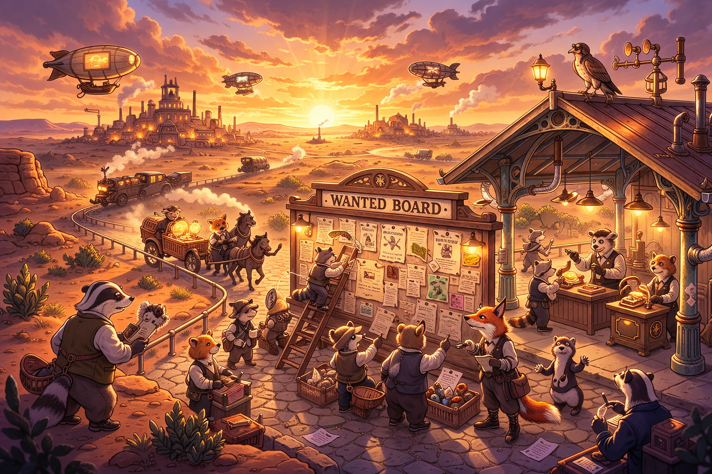

<!-- slide: 0 -->
# Orchestrate Agentic AI
## Context, Checklists, and No-Miss Reviews
#### Calvin Hendryx-Parker, CTO
#### Six Feet Up

_Orchestrate Agents, You Will_

<!-- slide: 1 -->
# Who am I

::: notes
- THANK YOU FOR COMING
- INTRODUCE YOURSELF
- who you are, who 6ftup is, general info
:::

<!-- slide: 2 -->
# What is this about, who is it for

  (_you_)
  want to things done
  (with .AI)

::: notes
My mission today is to help you understand how you can use LLM
agents to solve real problems you may encounter as a decision maker
and operator navigating the dynamic and complex world of modern
business.

If you
- have used AI in apps or the browser, but suspect that you could do more or get better results
- are technically enthusiastic, are familar with the terminal, or have the patience and persistence to give it a try.
- think LLMs seem to have great promise, but fear the ramification of the uncertain results.
- are curious how to extend the AI products you use to solve your problems without going through a vendor procurement process
:::

<!-- slide: 3 -->
# Where we are going (today)
## Where we are going we don't need roads

::: notes
We are going to a place where we can boil down some the noise so you
can feel confident making use and building your own simple agent based
systems.

If this go well, you will leave with access to all the tools we will
use here today and knowledge about how to apply them to everyday
problems your business has.  At least you should be able to take the
principles and find someone who can use them to build what you need.

We've created some simple tools whose aim is to help you have a more
focussed and reliable experience working with an LLM.  You can take
these tecnicques and even the files themselve and alter them to
include your opinions, heuristics, procedures and expertise.

Just as
we are zipping them up and offering them to you, you can spreading you
how to can do in the same.
:::

<!-- slide: 4 -->
# Do Agents need roads?

::: notes
Hard to avoid the 007 joke.

As agents go, 007 was predictably expensive, destructive, bad at
following rules and poorly behaved. A perhaps provides a good model
for thinking of what we need to get agents to do work for us that
brings more to the table than it take away.

If we want entertainment and a body count, 007 suceeds.  If we want something different we need different agents.

:::

<!-- slide: 5 -->
# The root of the problem
## Creating determinisn

with nondeterministic systems.

- quality input
- constraint
- dialectic
- visibility

::: notes
- Operational work, technical or more business orient is almost alway non-deterministic.
- LLMs are also non-deterministic
- How can we take problems that we know do not have deterministic solutions and create meaningful value with non-deterministic tools?

If you work in risk & compliance, your job is often wading
through ream of uncertainty to try to determine the best possible
decision.  An LLM may not provide perfect answer, but it can help you pinpoint issues and opportunities faster.

If we can narrow the frame and focus of the LLM, it can uncover
important information faster, giving us the opportunity to take more
time to dig deeper or respond or maybe just move on.

Anything that can remove complexity and uncertainty safely provides
value. There is something similar with using LLMs, which while they
can manage large of amount of data quickly, they inherently are
non-deterministic.
:::

<!-- slide: 6 -->
# My Agent
## The Tool For Job

> "Agents are models using tools in a loop"
>    _[Hannah Moran, Anthropic](https://simonwillison.net/2025/May/22/tools-in-a-loop/)_

An agent
- a context buffer w/ llm connection
- local tools: skills, subagents, mcp, hooks
- local resources: flat files, dbs, scripts, sockets, etc

::: notes
Our coding agent (claude) will be working in a basic sandbox that
provides access to basic *nix tools.  It has a context buffer when using Opus 4.6 of about
200k (can roughly the size of "Good To Great" by Jim Collins)

We will run this in a sandbox to limit what our agent has access to on our local system.
:::

<!-- slide: 7 -->
# 02 Orchestration

::: notes

Is a big word.

What does it mean Wikipedia has 3 definitions for
"Orchestration": for music, for computers and for games.  In all three
cases, you could make the argument orchestration is an act of using
rules to coordinate and manage a group of actors to accomplish
something meaningful.

For our purposes, orchestration is organizing more than one actor
(meat agent or digital) to do something useful.

:::

<!-- slide: 8 -->
# The problem

Claude, a new document and me makes 3.

::: notes

- talk about the issues of document review wrt to running a business
- lots of documents, hard know what is in them, what is important, misses can be expensive
- talk abou the naive aproach of paste and pray

<demo>
- introduce the document
- paste into Claude (polluted context)
- get some weak results
</demo>

This is also a good place to talk about how tools exist like claude's Legal skills.  That said, composing tools in workflow and understanding something about how they work underneath me you can use these technique with existing tools.

For the purpose of learning, we will build up from the filesystem.

:::

<!-- slide: 9 -->
# OH NO

> Those results were terrible!

::: notes
this slide can be skipped

- all the reasons why context gets polluted
- We need to make some constraints

<!-- slide: 10 -->
# Tragedy of The <s>Commons</s> Context

- context is a workspace, not a warehouse.
- context rules everything around me

::: notes
- define context
- context is madness to manage by hand. Imagine if you command commands changed based on the 500 entries in your command history (better analogy?)
- Context is a finite resource, not infinite memory — performance degrades as context fills ("lost in the middle")
- This is context bitrot: every search result, every tangent, every tool call consumes tokens and pushes the signal further from the model's attention
- old school state management to the rescue
- We can use chromadb and sqlite to structure our document so the
  agent can search and query it w/ impunity.
:::

<!-- slide: 11 -->
# Memory & Skills Demo

Skills, skills, skills

::: notes

How do we talk to the sqllite and chroma? How do we load our
data into them rather than just having it swished into the context?

Introduce the concept of skills and why they are so good for quickly prototyping tasks and processes.

- they start super simple as markdown documents
- scale up to complex systems like garry tan's gstack

<demo>
see: [demo](../demo/terminal.md)
</demo>
:::

<!-- slide: 12 -->
# From search to assessment

<DEMO>

::: notes

Search is great, but I have reviewed many documents like this, I have an idea about
what I care about and would like to get some automated recon before
I have to dig into the doc myself.  I also want to delegate as much of this digging to my agents.

I want the LLM to give me feedback, but I want to be sure that
feedback is useful, focussed, and actionable.

To do this we are going to employ an idea from AI testing, the eval.
When testing LLMs, we assume that our response are nondeterministic,
so we must create a sort of bracketting of test questions and an
assessment of answers.

We will use an eval skill we have created where we give our skill a
criterion file, the skill uses our memory in the dbs, and then returns
answers.

<demo>
- show eval skill
- run naive eval
- run better eval
</demo>

The questions constrain and focus the agent's return, our databases constrain the data acted upon.
:::

<!-- slide: 13 -->
# Let's Orchestrate

<DEMO>

- ingest documents
- output assessments

::: notes
We've gotten some good results, but what if have 3 proposals. 10 proposals?

We have been orchestrating claude through our prompts, then our skills. What if claude drove more of this orchestration itself.

First let's consider what would be helpful at scale?
:::

<demo>
- Introduce subagents as a concept
  - look at our agents
    - data-investigator
	- data-loader
	- contract-eval
	- response-drafter
	- verification
- create a workflow: ask claude about creating a workflow for docs in, assessments out
  - talk about routing and handoff
  - talk about adversarial verification as a way to limit mistakes before manual proofing
  - show the system spinning up to analyze our doc, talk about concurrency/parallelism
</demo>
:::

<!-- slide: 14 -->
# Show Your Work

<DEMO>

::: notes
- Every action is logged: what was loaded, what was searched, what was evaluated, by whom
- In regulated industries this is compliance. For everyone else, it's trust
- Engineering parallel: this is your CI log — you can trace any finding back to the evidence
- The audit trail is append-only. Agents can't cover their tracks
:::

<!-- slide: 15 -->
# Takehome

[QR Code](download link)

::: notes
Talk about repo and playbook, how to install with claude code or cowork.

Talk about how these tools are cheap and easy to make with LLMs. Built for purpose software is now a reality. You can create skill and agents and arrange them to get real work done quickly w/ some care and patience.

Increasing determinism is the key, by constraint, good inputs, and
deploying the brownian ratchet of iterative critique and improvement.  These process apply to full software development as well. Testing, CI/CD, specification building, PR workflows, etc are just more formalized ways to create more determinism.
:::

<!-- slide: 16 -->
# 11 Your Future [could be] Agentic

::: notes
We've talked about how you can easily get started with agents, but in the greater world, agentic orchestration is being used to emulate whole software orgs (ala gastown) or opensource ecosystems (ala wasteland) or communities of agents like moltbook.  Understanding how to use agents locally will help you deal with the every growing landscape of agent driven compute we are increasingly living in.
:::

<!-- slide: 17 -->
# /exit agent

::: notes
Closing remarks --
- thank you for coming on this speedy ride through building an agent workflow
- reinforce takeaways
  - don't trust context, manage the data you want the agent to use explicitly
  - use skills and agents to increase determinism so you get good results from the LLM
  - use skills and agents to capture your workflows so you can automate more of your toil
:::
